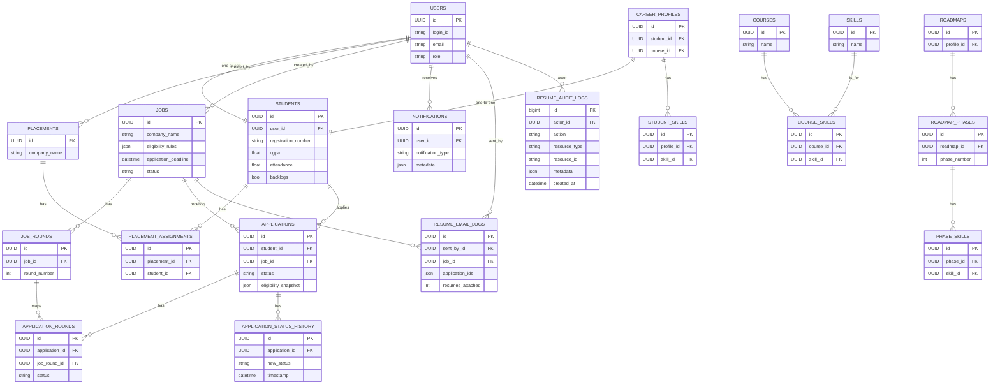

**Database Reference**

This document summarizes the schema, an ER diagram, per-model highlights, index recommendations, and common QuerySet examples for the iLEAD Placement Portal.

**ER Diagram**



**Key Models & Purpose**
- **Core models**: [backend/core/models.py](backend/core/models.py) — `User`, `Student`, `Placement`, `PlacementAssignment`, `CSVUploadLog`, `AuditLog`, `ExternalClickLog`.
- **Jobs**: [backend/apps/jobs/models.py](backend/apps/jobs/models.py) — `Job`, `JobRound` (job postings and their rounds).
- **Applications**: [backend/apps/applications/models.py](backend/apps/applications/models.py) — `Application`, `ApplicationRound`, `ApplicationStatusHistory`, `Notification`, `ResumeEmailLog`.
- **Career**: [backend/apps/career_os/models.py](backend/apps/career_os/models.py) — `Course`, `Skill`, `CourseSkill`, `LearningResource`, `CareerProfile`, `StudentSkill`, `Roadmap`, `RoadmapPhase`, `PhaseSkill`.
- **Auditing**: [backend/apps/auditing/models.py](backend/apps/auditing/models.py) — `ResumeAuditLog` (fine-grained resume/template audit trail).
- **Common utilities**: [backend/apps/common/models.py](backend/apps/common/models.py) — `SoftDeleteModel` and custom managers for soft-delete behaviour.

**Index & Schema Recommendations**
- Keep `login_id` indexed (already indexed) and consider indexing `role` if role-filter queries are frequent.
- Index `registration_number` (already indexed); consider index or materialized bucket for `cgpa` if you filter by CGPA ranges often.
- Index `status` and `application_deadline` on `Job` for fast active-job queries; use Postgres GIN index for JSON queries on `eligibility_rules` if needed.
- Composite index `(job, status)` or `(job, applied_at)` on `Application` can speed recruiter views.
- `ResumeAuditLog` already has useful indexes; keep them for audit queries.

**Common QuerySet Examples**
- Active jobs with upcoming deadlines:

```python
from django.utils import timezone
Job.objects.filter(status='active', application_deadline__gt=timezone.now()).order_by('application_deadline')
```

- Applications for a job with student details (efficiently):

```python
applications = Application.objects.filter(job=job).select_related('student__user').prefetch_related('rounds')
```

- Student's latest applications:

```python
Application.objects.filter(student=student).select_related('job').order_by('-applied_at')[:50]
```

- Update application status inside a transaction and record history:

```python
from django.db import transaction

with transaction.atomic():
    app = Application.objects.select_for_update().get(pk=app_id)
    old_status = app.status
    app.status = 'shortlisted'
    app.save(update_fields=['status', 'updated_at'])
    ApplicationStatusHistory.objects.create(application=app, old_status=old_status, new_status=app.status, changed_by=user)
```

- Soft-delete usage (models inheriting `SoftDeleteModel`):

```python
# soft delete
obj.soft_delete(user=request.user)

# include deleted records
Model.all_objects.with_deleted().filter(...)
```

**Where to look in the repo**
- Model definitions: [backend/core/models.py](backend/core/models.py), [backend/apps/jobs/models.py](backend/apps/jobs/models.py), [backend/apps/applications/models.py](backend/apps/applications/models.py), [backend/apps/career_os/models.py](backend/apps/career_os/models.py), [backend/apps/auditing/models.py](backend/apps/auditing/models.py), [backend/apps/common/models.py](backend/apps/common/models.py).
- Seed scripts: [backend/seed_full_mock_data.py](backend/seed_full_mock_data.py), [backend/seed_real_jobs.py](backend/seed_real_jobs.py).
- Signals & tasks: check `post_save` signals in [backend/apps/jobs/models.py](backend/apps/jobs/models.py) and [backend/apps/applications/models.py](backend/apps/applications/models.py), and task modules under `apps/*/tasks.py`.

**Next steps (optional)**
- I can generate a PNG/SVG of the Mermaid diagram and add it to `docs/`.
- I can produce per-model detailed markdown files (field descriptions + recommended migrations).
- I can create Django migration stubs to add suggested indexes.

---

Generated on: 2026-05-30
